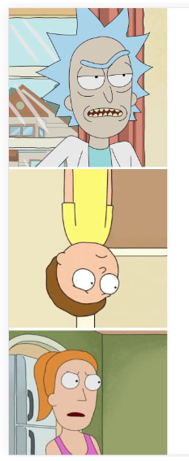

Para esta práctica probaremos a realizar una petición y guardar la información en un estado, ayudándonos de un useEffect para realizar la petición una única vez.

1. realizaremos una petición a la API de rick y morty
2. guardaremos los datos de la api en un estado
3. pintaremos los personajes de rick y morty con los atributos que queramos, imágenes mínimo
4. cada personaje será pintado en un componente específico
5. componente hijo, deberá tener un estado que controle que si le hacemos click a una imagen de un personaje esta rote 180 grados (puede ser mediante un cambio de clase o de estilos en línea apoyándose en el estado creado)

