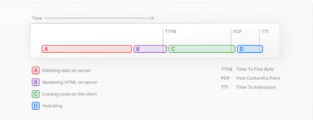

# TEMARIO RTC - 2. RUTAS

## 1. Layout y componente Link
1. Creación de rutas.
2. Layouts y templates.
3. Metadata.
4. El componente Link.
5. Navegación imperativa.
6. Redirecciones.

## 2. Interfaz y estados del Loading
1. El componente loading.tsx
2. Server Side Rendering. 
3. Straming.

## 3. Grupos de rutas y rutas dinámicas
1. Definir un grupo de rutas.
2. Rutas dinámicas.

## 4. Slots e intercepción de rutas
1. Interceptando rutas con el router de Next.js
2. Implementación de un modal mediante interceptores y slots.
3. El componente Modal.

## 5. Route Handlers
> Los Route Handlers en Next.js 13+ (App Router) permiten crear API endpoints dentro de la carpeta
1. Route Handlers.
2. Comportamiento.
3. Funciones Dinámicas.
4. Respuestas sin interfaz.

## 6. Middlewares
1. Configuración de un middleware.
2. Uso de la propiedad matcher.
3. Cookies y cabeceras.
4. Utilizando waitUntil y NextFetchEvent.

## 7. Traducir la app
1. Internacionalización en Next.js: Configuración y enrutamiento.
2. Añadir traducciones.